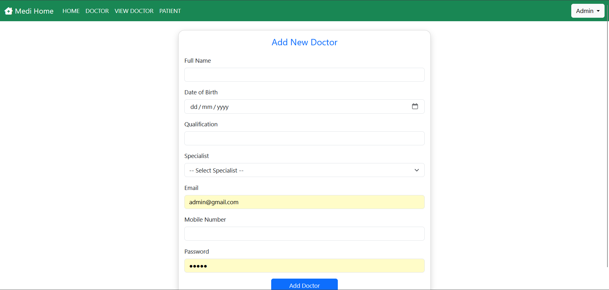
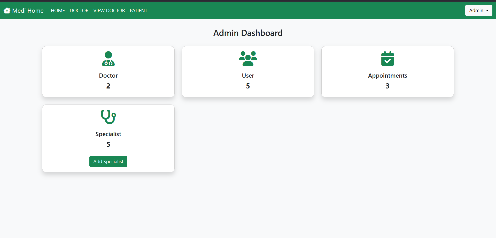
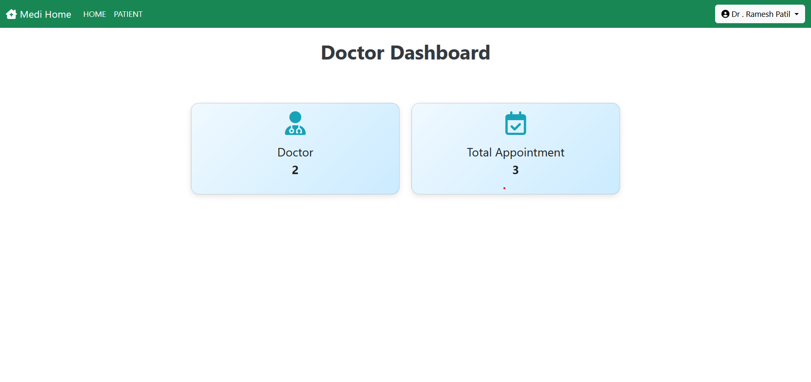
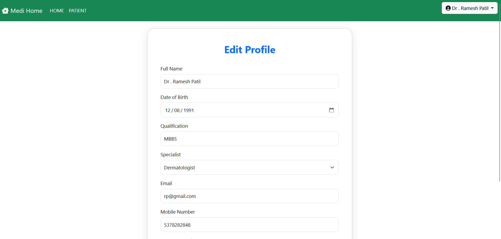
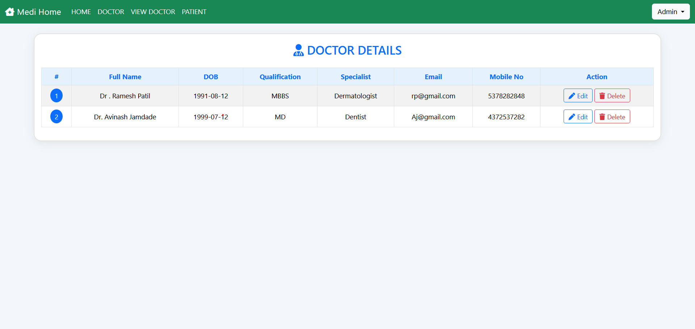
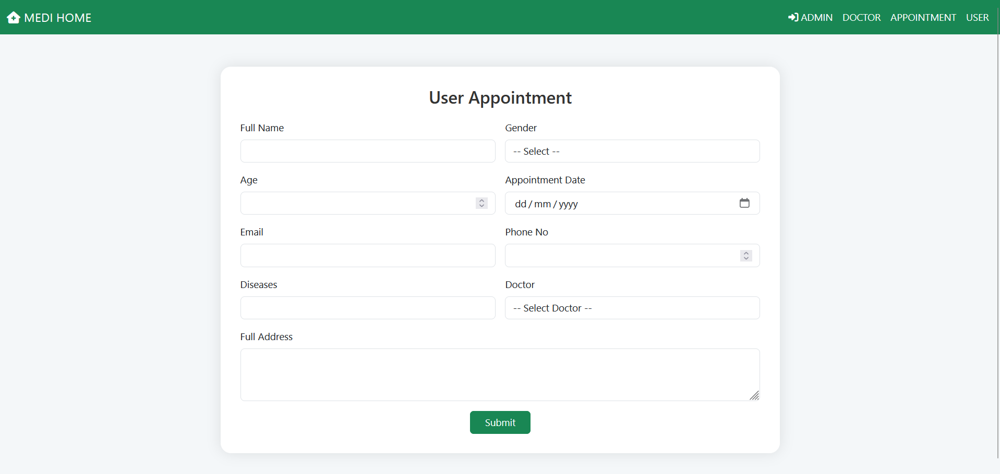
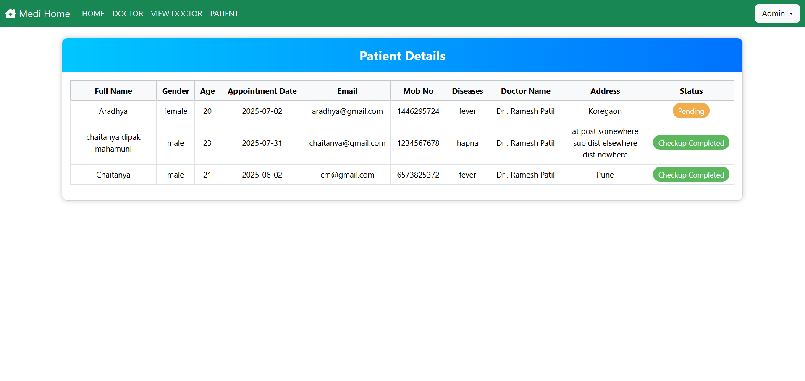
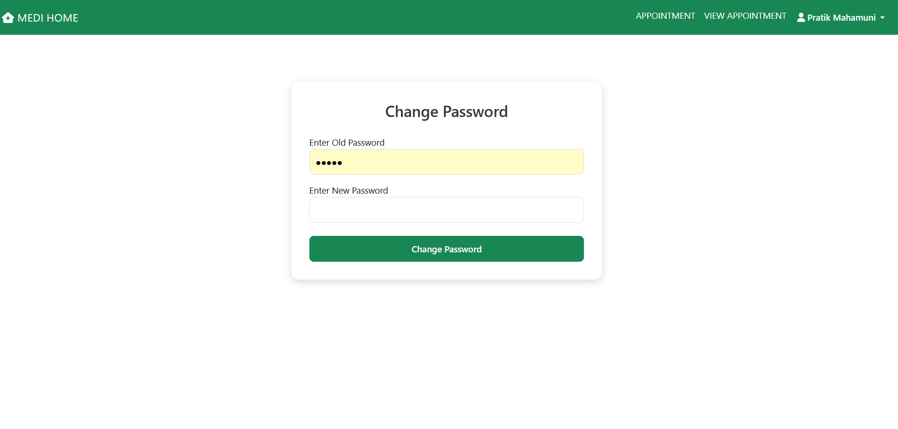

# 🏥 Hospital Management System

The **Hospital Management System** is a web-based application built using **Java (JSP + Servlets)**, **MySQL**, and **Maven**. It is designed to streamline hospital operations like managing doctor data, user registration, and appointment bookings.

This project follows the **MVC (Model-View-Controller)** design pattern and provides three roles: **Admin**, **Doctor**, and **User/Patient**.

---

## 🚀 Features

### ✅ Admin Module
- Add, update, delete doctors and specialists
- View registered users
- View all patient appointments
- Admin login/logout

### ✅ Doctor Module
- Doctor login/logout
- View and update appointment statuses
- Edit profile and change password

### ✅ User/Patient Module
- User registration and login
- Book an appointment with a doctor
- View appointment history
- Change password

## 💻 Tech Stack

| Technology     | Description                  |
|----------------|------------------------------|
| Java           | Core programming language    |
| JSP & Servlet  | Backend & frontend rendering |
| JDBC           | Database connectivity        |
| MySQL          | Relational database          |
| Maven          | Project management/build     |
| Apache Tomcat  | Web server                   |
| HTML/CSS       | Frontend and layout          |

---

## 🗃️ Project Structure (Maven)

Hospital/
├── src/
│ ├── main/
│ │ ├── java/
│ │ │ └── com.admin.servlet, com.dao, com.db, com.doctor.servlet, ...
│ │ ├── resources/
│ │ └── webapp/
│ │ ├── component/
│ │ ├── doctor/
│ │ ├── img/
│ │ └── WEB-INF/
│ │ └── web.xml
├── pom.xml
└── README.md

## 📸 Screenshots

### 🏠 Home Page

### 🧑‍⚕️ Add Doctor

### 🧑‍💼 Admin Dashboard

### 👨‍⚕️ Doctor Dashboard

### ✏️ Edit Doctor Profile

### 📋 Doctor Details

### 📅 User Appointment

### 🧾 Patient Details

### 🔐 Change Password

